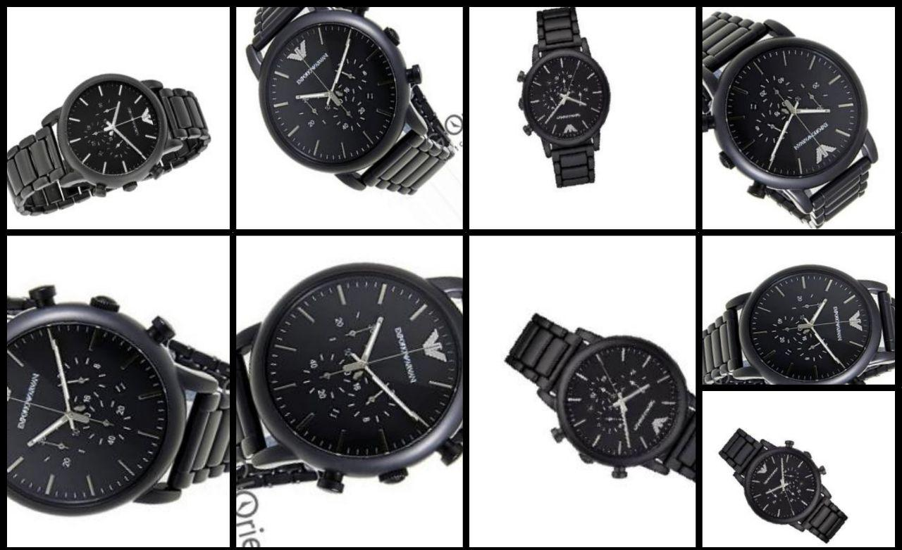
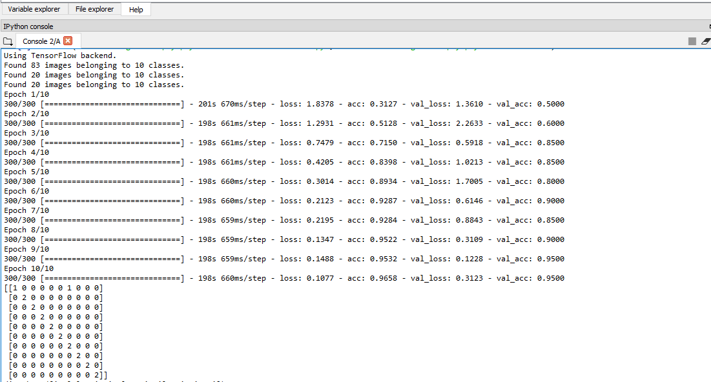
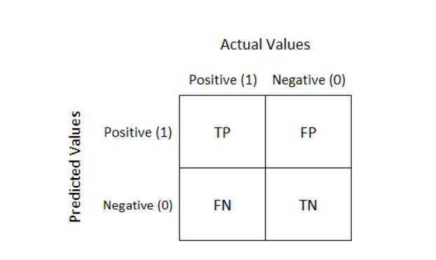
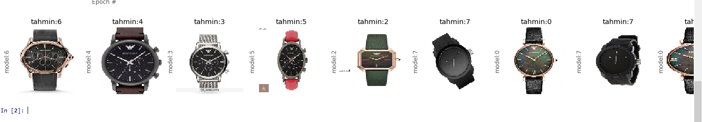

# WATCH MODEL RECOGNITION FROM IMAGES

  ## Intrıduction

In this notebook, I have created a small watch image dataset for 10 watches. Data set includes train, test and validation folders. There are 12 images for each watch. I used 8 image for train, 2 images for validation and 2 images for testing. Our aim is recognizing watch brand and model. 

### Emporio Armani - Ar1971 

## Libraries
I utilized from Keras for development. You can reach documents for Keras from [here](https://keras.io/).

```python
import os
import keras
from keras.models import Sequential
from keras.layers import Dense, Dropout, Flatten
from keras.layers import Conv2D, MaxPooling2D
from keras import backend as K
import tensorflow as tf
from keras.preprocessing.image import ImageDataGenerator
import matplotlib.pyplot as plt
import numpy as np
```

## GPU Usage
We need more processing power for training with images. The input of the model is 100 x 100 px images. The images are RGB and our input size will be 100 x 100 x 3 x number_of_samples. Including epoch size even a small data set we will do large proceses. We speed up our training we will use GPU instead of CPU. We have to install tensorflow GPU for this operation. 

# Selecting GPU
```ruby
os.environ["CUDA_DEVICE_ORDER"]="PCI_BUS_ID";
os.environ["CUDA_VISIBLE_DEVICES"]="0";
os.environ['TF_CPP_MIN_LOG_LEVEL'] = '2'
config = tf.ConfigProto()
config.gpu_options.per_process_gpu_memory_fraction = 0.5
keras.backend.tensorflow_backend.set_session(tf.Session(config=config))
cfg = K.tf.ConfigProto()
cfg.gpu_options.allow_growth = True
K.set_session(K.tf.Session(config=cfg))
```

## Paramater Setting


```python
train_batch_size=64 # Ekran kartımızın kaldırabileceği boyutta seçilmelidir. Aksi takdirde hata alırız.
validation_batch_size=64
image_width=100 # resim genişliği
image_height=100 #resim yüksekliği
epochs=10  #çağ sayısı
number_of_classes=10  #sınıf sayısı tespit edeceğimiz saat sayısı 10'dur.
```

## Keras Data Augmentation 
Our data set is very small, this sittuation may cause overfitting, so we can increase data by data augmentation technic. You can reach information abaout data augmentation from [here](https://keras.io/preprocessing/image/)  .


```python

#loading images
#Augmenting data by shifting, rotating and change luminance.
# Be carefull at data augmentation step. 
train_datagen = ImageDataGenerator( 
        rescale=1. / 255,  #Normalizing inputs.
        rotation_range=360,
        width_shift_range=0.2,
        height_shift_range=0.2,
        brightness_range=(0.5,1.0),
        zoom_range=0.1)
test_datagen = ImageDataGenerator(rescale=1. / 255)


training_batch = train_datagen.flow_from_directory('new_data/train',
                                             target_size = (image_width, image_height),
                                             batch_size = train_batch_size,
                                             class_mode = 'categorical',
                                             shuffle=True
                                             )
validation_batch=test_datagen.flow_from_directory('new_data/validation',
                                             target_size = (image_width, image_height),
                                             batch_size = validation_batch_size,
                                             class_mode = 'categorical',
                                             shuffle=True
                                            )
test_batch=test_datagen.flow_from_directory('new_data/test',
                                             target_size = (image_width, image_height),
                                             batch_size = validation_batch_size,
                                             class_mode = 'categorical',
                                             shuffle=True
                                            )
```

## Setting up the model
We use CNN. We utilize max pooling, dropout and relu activation function. Our loss fuction is categorical cross entrophy.

```python
model = Sequential()
model.add(Conv2D(32, kernel_size=(3, 3),activation='relu',input_shape=(image_width,image_height,3)))
model.add(Dropout(0.5))
model.add(Conv2D(128, (3, 3), activation='relu'))
model.add(MaxPooling2D(pool_size=(2, 2)))
model.add(Dropout(0.5))
model.add(Conv2D(64, kernel_size=(3, 3),activation='relu',input_shape=(image_width,image_height,3)))
model.add(Conv2D(32, (3, 3), activation='relu'))
model.add(MaxPooling2D(pool_size=(2, 2)))
model.add(Dropout(0.25))
model.add(Flatten())
model.add(Dense(128, activation='relu'))
model.add(Dropout(0.3))
model.add(Dense(number_of_classes, activation='softmax'))
model.compile(loss='categorical_crossentropy',optimizer='Adam',metrics=['accuracy'])
```

#Fitting the model
```python
H=model.fit_generator( 
    training_batch, 
    steps_per_epoch=300, #her çağda  kaç örnek türeteceğimizi belirliyoruz.
    epochs=epochs, # kaç çağ olacağını belirtiyoruz yukarıda 10 olarak belirtmiştik.
    validation_data=validation_batch, 
    validation_steps=10
    ) 
 ```
 
## Confusion matrix



```python
x_test,y_test=test_batch.next()
y_pred_test=model.predict(x_test)
from sklearn.metrics import confusion_matrix
cm=confusion_matrix(y_test.argmax(axis=1), y_pred_test.argmax(axis=1))
print(cm)
print(H.history.keys())
 ```
 ### Results
We can predict with %90 accuracy. 
```python
def show_images(images, cols = 1, titles = None,labels=None):
    """Resimleri figürde gösterir..
    
    Parameters
    ---------
    images: np.arrays dizisidir.
    
    cols (Default = 1): figürdeki kolon sayısıdır.(n_images/float(cols))).
    
    titles: Her resmin başlığıdır.
    """
    assert((titles is None) or (len(images) == len(titles)))
    n_images = len(images)
    if titles is None: titles = ['Image (%d)' % i for i in range(1,n_images + 1)]
    fig = plt.figure()
    for n, (image, title) in enumerate(zip(images, titles)):
        a = fig.add_subplot(cols, np.ceil(n_images/float(cols)), n + 1)
        if image.ndim == 2:
            plt.gray()
        plt.imshow(image)
        a.set_title('tahmin:' + str(titles[n]))
        a.set_ylabel('model:' + str(labels[n]))
        # Hide grid lines
     
        
        # Hide axes ticks
        a.set_xticks([])
        a.set_yticks([])
    fig.set_size_inches(np.array(fig.get_size_inches()) * n_images/2)
    plt.show()

   
show_images(x_test, cols = 1, titles =y_pred_test.argmax(axis=1) ,labels=y_test.argmax(axis=1))
```
   
 
## Saving Models
```python
  model.save_weights('model1_weights.h5')
     # serialize model to JSON
     model_json = model.to_json()
     with open("model1.json", "w") as json_file:
     json_file.write(model_json)
 ```    
   
